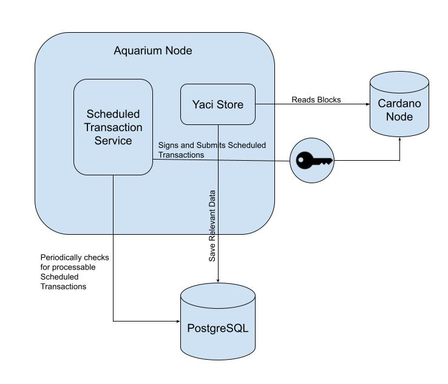

# FluidTokens Aquarium Node 

Welcome to the FluidTokens Aquarium Node Repo

The Aquarium Node is a java app which indexes FluidTokens users' _Tanks_ utxos and processes _Scheduled Transactions_
when conditions are met.

Node operators will be required to stake a certain amount of FLDT tokens in order to be allowed to process _Scheduled Transactions_.

Operators will periodically receive compensation for the work executed.

## List of materials

- 30,000 $FLDT
- Docker File (provided by us in this repository)
- 1 GB of RAM
- 1 GB of Free Disk Space


## TLDR (cardano mainnet)

Steps to run an Aquarium Node are simple:

1. rename the file docker/.env.example in .env
2. set blockfrost APIKEY and the mnemonic phrase of a dedicated wallet containing only and 10 ADA inside the .env file (THIS SHOULD BE A DEDICATED SEEDPRHASE, DO NOT USE ANY ACTIVE SEEDPHRASE) this will be the aquarium node 
3. run `docker compose build` inside the docker folder
4. run ` docker compose up` inside the docker folder
5. Get 30k FLDT on a hot or cold wallet (this wallet can be even different from the aquarium node to make it safer) - you can get them on [minswap](https://minswap.org/tokens/fldt) 
6. Delegate your 30k FLDT from the wallet containing the 30k FLDT to your node address generated at point 2. [here](https://aquarium-qa.fluidtokens.com/validator)
7. That's it! First time will take a bit to sync with the genesis of Aquarium tx but then will be super fast indexer
8. Every month 50% of all the generated fees are split across the nodes that performed transactions

## How it works

The Aquarium Node requires two additional components to work:

1. A Cardano Node (which can either be local or remote)
2. A local Postgres Database

The Aquarium Node leverages [BloxBean Yaci Store](https://github.com/bloxbean/yaci-store) to index the Cardano blockchain and 
saves to a local database relevant data such as:

* the UTxOs of Aquarium Scheduled transactions
* Aquarium Parameters UTxO 
* Aquarium Staker UTxOs

Periodically, the node loads all the UTxOs of the `Scheduled Transaction` contract, deserialise the attached data (if any),
checks if any of the _Scheduled Transaction_ can be executed and eventually prepares, signs and submits the transaction to a Node via [Blockfrost](https://blockfrost.io/).

Here below a high level design of the Acquarium Node:



### Alternative solutions

When designing the Aquarium node, alternative solutions were considered and after careful considerations it was agreed to proceed with using 
Java and Yaci Store.

The most common approach adopted in the Cardano ecosystem is to used Kupo and Ogmios as services to scan the blockchain and query utxos.
Although these two services offer all the apis required to the Aquarium Node, it also means an operator requires to locally run a Cardano Node
along Kupo and Ogmios, significantly increasing complexity and costs of running an Aquarium Node.

By leveraging Yaci, while some additional configuration is required, the Aquarium Node is able to both traverse the chain and locally store relevant utxo.

Using Yaci Store also gives the following benefits:
1. Simple, concise and fast code to access data via SQL queries
2. Straightforward horizontal scaling: by replicating the DB and launching Yaci in read only mode, is very simple to linearly scale
the Aquarium Node
3. Blockfrost api: Yaci can serve blockfrost compatible APIs out of the box

## How to build

The Aquarium node is a Java Spring Boot App, and you can build a standalone, self-contained _fat jar_ by executing in the root 
of the project the command 

```bash
./gradlew bootJar
```

The generated `jar` will be found in `build/libs/ft-aquarium-node-<version>.jar`.

You can then either use this library directly on your host system via 

```bash
java -jar build/libs/ft-aquarium-node-<version>.jar 
``` 

Or build a docker image with it.

The FluidTokens team has conveniently built a docker images for you already, but to maximise safety, we do recommend 
to build and run your own.

## How to run

This guide will only illustrate a basic, non-production ready, setup to run the Aquarium Node.

In the `docker` folder you will find an example `docker-compose.yaml` which you can use to run the node on both supported 
network: `mainnet` and `preview`.

In order to configure your node, you can leverage `.env` files to customise the way the node is run.

An `mainnet` compatible, example `.env.example` has been provided with pre-configured value for the non-sensitive properties.

For the preview network you will have to replace all network related properties and adjust accordingly

### Customise your `.env` file for mainnet

Copy the `.env.example` into `.env` file.

Set the following two env properties:

```bash
## Blockfrost Key, the free account plan is ok
BLOCKFROST_KEY=

## Wallet Seed (mnemonic), this wallet should contain 30k FLDT and 10 ADA to start, create a dedicated wallet and never share the mnemonic with anyone
WALLET_MNEMONIC=lorem ipsum
```

Ensure that the wallet has already completed the staking procedure or received BOT operator stake delegation. Please 
check the fluidtokens website for further details on how to perform stake and unstake.

### Aquarium Node Health Check

The Aquarium node runs in two modes: syncing and normal.

Syncing mode happens when a new node is started, or the db is cleared and last usually few minutes to a few hours depending on
network connection and hardware.

If your node is correctly syncing, you will find something like this in the logs:

```bash
2025-05-19T21:33:06.286Z  INFO 1 --- [nio-8080-exec-2] c.f.a.offchain.controller.Healthcheck    : [HEALTH] Aquarium Node is correctly syncing the blockchain.
```

Once the syncing is complete, some health checks are ran every few minutes, and you should see something like:

```bash
2025-05-19T22:31:06.286Z  INFO 1 --- [nio-8080-exec-2] c.f.a.offchain.controller.Healthcheck    : [HEALTH] Aquarium Node is healthy
```

You can manually check the status of your node running `curl http://localhost:8080/__internal__/healthcheck | jq .`. 
You will either see a message telling your what the node is doing, or a health check report which will look like:

```json
{
  "dbOkay": true,
  "parametersOk": true,
  "parametersRefInputOk": true
}
```

Last but not the least, the Node also runs some non-critical checks like wallet balance and staking status.

Grep for `HEALTH` in your logs and check if you get any of:
```bash
[HEALTH] No utxo found for wallet. Ensure you have at least one UTXO with only ada in it.
```
or 
```bash
[HEALTH] The current wallet does not have any FLDT delegated. Ensure you're staking FLDT to the Node's wallet.
```

and act accordingly

### How to understand if my node is synced?

Very simple, issue a `docker logs aquarium --tail 50`

If you see something that resembles this line:
```bash
2025-02-24T11:05:00.500Z INFO 1 --- [ntLoopGroup-4-1] c.b.c.y.s.c.service.CursorServiceImpl : # of blocks written: 1
2025-02-24T11:05:00.500Z INFO 1 --- [ntLoopGroup-4-1] c.b.c.y.s.c.service.CursorServiceImpl : Block No: 11525533
```

if means your node is up to tip and is processing 1 block at the time (i.e. the latest block).

## Development Notes

### How to Setup local Postgres for dev

Init local dev psql db

`createuser --superuser postgres`

`psql -U postgres`

Then create db:

```
CREATE USER fluidtokens PASSWORD 'password';

CREATE DATABASE aquarium WITH OWNER fluidtokens;
```
