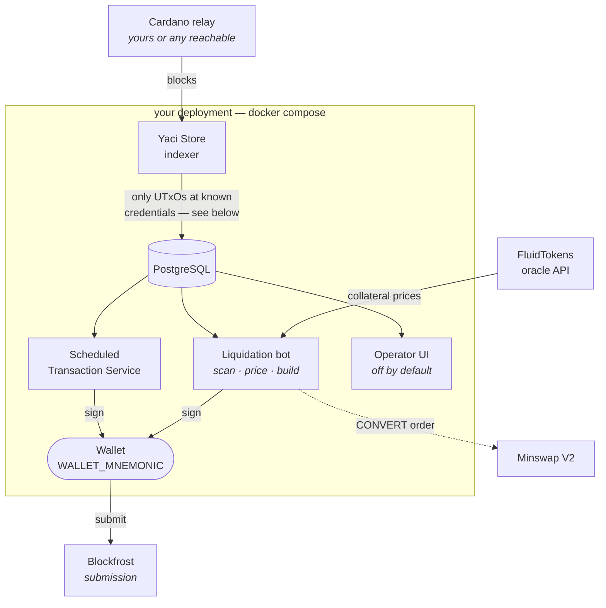

# FluidTokens Aquarium Node

A Java service that operators run against the Cardano chain. It does **two** jobs:

1. **Scheduled Transactions** — indexes FluidTokens users' _Tank_ UTxOs and executes their scheduled
   transactions when the conditions are met.
2. **Lending v4 auto-liquidation** — watches lending-v4 loans and, when one becomes liquidatable,
   either sells the collateral through Minswap (`CONVERT`) or repays the lender from your own wallet
   and keeps the collateral (`ANTICIPATE`).

Both reuse the same indexer, scheduler and wallet. **Both ship switched off** — see
[docs/deploying.md](docs/deploying.md) §8.

Operators stake 30,000 FLDT to be allowed to process scheduled transactions, and are compensated
monthly from the fees generated.

## What you need

- **30,000 $FLDT**, delegated to the node (held in a separate wallet — see the deployment guide)
- **Docker** with the Compose plugin
- A **Cardano relay** to connect to, and a **Blockfrost** project key
- A **dedicated wallet mnemonic**, used for nothing else
- RAM and disk: the shipped Compose file caps the node at **4 GB**. Disk is dominated by Postgres
  and depends on how far back you sync — watch it during the first sync rather than trusting a
  figure

## Documentation

| | |
|---|---|
| **[docs/deploying.md](docs/deploying.md)** | Standing up a node for the first time — keys, configuration, first start, reaching the UI safely, arming the bot, the market specification |
| **[docs/upgrading.md](docs/upgrading.md)** | Already running one — version bumps, and the re-index/wipe sequence a contract redeploy requires |

Both cover **Docker Compose**. Systemd, Kubernetes and Nomad all work; the ordering, secrets and
exposure guidance applies unchanged.

**You never configure a contract address, a script hash or a sync start point.** They ship in the
image, verified against the chain before release. When FluidTokens redeploy, you bump the image
tag — that is the whole upgrade. Optional settings (arming, markets, margin, UI) live in
`docker/.env.advanced.example`, and a node that never touches them is a correct node.

## Quick start (mainnet)

```bash
git clone https://github.com/FluidTokens/ft-aquarium-node.git
cd ft-aquarium-node/docker
cp .env.example .env
chmod 600 .env                  # it will hold a seed phrase
# fill in the six values it contains, then:
docker compose up -d
docker compose logs -f aquarium
```

Then get 30k FLDT (for example on [Minswap](https://minswap.org/tokens/fldt)) into a **separate**
wallet — it can be cold — and delegate it to your node's address
[here](https://aquarium.fluidtokens.com/validator). The node's own hot wallet only needs about
10 ADA to operate.

The first sync takes a while; after that it tracks the tip. Every month 50% of generated fees are
split across the nodes that performed transactions.

**⛔ The node ships with everything OFF** — the scheduled-transaction processor, the liquidation bot
and compound all have to be turned on deliberately. Read
[docs/deploying.md](docs/deploying.md) §8 before arming anything, and rehearse in `shadow` first.

**⛔ Do not publish port 8080.** Nothing served there is authenticated, and
`LOANS_UI_ENABLED=false` does **not** close it: that flag removes the HTML readiness page only.
`/api/v1/loans`, `/api/v1/loans/liquidations`, `/api/v1/loans/oracle`, `/healthcheck` and
`/actuator/*` stay up and still disclose your positions. Reach the port through an SSH tunnel or a
private network — [docs/deploying.md](docs/deploying.md) §7.

## How it works

The node needs two things beside itself: a **Cardano relay** for the chain feed, and a **Postgres**
database it owns. Transactions are submitted through **Blockfrost**.


```mermaid
flowchart TB
    relay["Cardano relay<br/><i>yours or any reachable</i>"]
    oracle["FluidTokens<br/>oracle API"]
    bf["Blockfrost<br/><i>submission</i>"]
    minswap["Minswap V2"]

    subgraph aq["your deployment — docker compose"]
        yaci["Yaci Store<br/>indexer"]
        db[("PostgreSQL")]
        sched["Scheduled<br/>Transaction Service"]
        liq["Liquidation bot<br/><i>scan · price · build</i>"]
        ui["Operator UI<br/><i>off by default</i>"]
        wallet(["Wallet<br/>WALLET_MNEMONIC"])
    end

    relay -- "blocks" --> yaci
    yaci -- "only UTxOs at known<br/>credentials — see below" --> db
    db --> sched & liq & ui
    oracle -- "collateral prices" --> liq
    sched & liq -- "sign" --> wallet
    wallet -- "submit" --> bf
    liq -. "CONVERT order" .-> minswap
```

**What gets indexed:** Aquarium Scheduled Transaction UTxOs, the Aquarium Parameters UTxO, Aquarium
Staker UTxOs, and the lending-v4 contract UTxOs.

**⛔ Only UTxOs at credentials the node knew about when the block went past are kept.** The filter is
applied at write time, so adding a contract address later does not backfill — and after a contract
redeploy a restart is not enough. [docs/upgrading.md](docs/upgrading.md) §3 is the one section to
read before you meet that.

### Alternative solutions

When designing the Aquarium node, alternative solutions were considered and after careful considerations it was agreed to proceed with using 
Java and Yaci Store.

The most common approach adopted in the Cardano ecosystem is to used Kupo and Ogmios as services to scan the blockchain and query utxos.
Although these two services offer all the apis required to the Aquarium Node, it also means an operator requires to locally run a Cardano Node
along Kupo and Ogmios, significantly increasing complexity and costs of running an Aquarium Node.

By leveraging Yaci, while some additional configuration is required, the Aquarium Node is able to both traverse the chain and locally store relevant utxo.

Using Yaci Store also gives the following benefits:
1. Simple, concise and fast code to access data via SQL queries
2. Straightforward horizontal scaling: by replicating the DB and launching Yaci in read only mode, is very simple to linearly scale
the Aquarium Node
3. Blockfrost api: Yaci can serve blockfrost compatible APIs out of the box

## Building it yourself

You do not need to: CI publishes an image built from `main` **after** running the full test suite.
If you would rather verify what you run, you need JDK 21:

```bash
./gradlew bootJar               # build/libs/ft-aquarium-node-<version>.jar
docker build -t ft-aquarium-node:local .
```

The image records the commit it was built from and reports it on **`/actuator/info`** — including
whether the tree was dirty, and `unknown` when it could not tell. It is also the first line of the
startup banner.

```bash
curl -s http://localhost:8080/actuator/info | jq .build
```

See [docs/deploying.md](docs/deploying.md) §11.

## Development Notes

### How to Setup local Postgres for dev

Init local dev psql db

`createuser --superuser postgres`

`psql -U postgres`

Then create db:

```
CREATE USER fluidtokens PASSWORD 'password';

CREATE DATABASE aquarium WITH OWNER fluidtokens;
```
