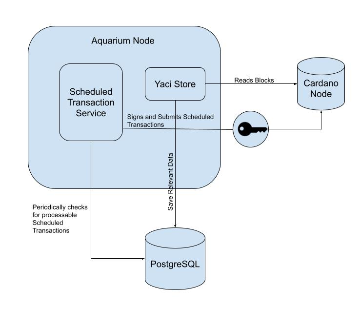

# FluidTokens Aquarium Node 

Welcome to the FluidTokens Aquarium Node Repo

The Aquarium Node is a java app which indexes FluidTokens users' _Tanks_ utxos and processes _Scheduled Transactions_
when conditions are met.

Node operators will be required to stake a certain amount of FLDT tokens in order to be allowed to process _Scheduled Transactions_.

Operators will periodically receive compensation for the work executed.

## List of materials

- 30,000 $FLDT
- Docker File (provided by us in this repository)
- 1 GB of RAM
- 1 GB of Free Disk Space


## TLDR (cardano mainnet)

Steps to run an Aquarium Node are simple:

1. rename the file docker/.env.example in .env
2. set blockfrost APIKEY and the mnemonic phrase of a dedicated wallet containing only and 10 ADA inside the .env file (THIS SHOULD BE A DEDICATED SEEDPRHASE, DO NOT USE ANY ACTIVE SEEDPHRASE) this will be the aquarium node 
3. run `docker compose build` inside the docker folder
4. run ` docker compose up` inside the docker folder
5. Get 30k FLDT on a hot or cold wallet (this wallet can be even different from the aquarium node to make it safer) - you can get them on [minswap](https://minswap.org/tokens/fldt) 
6. Delegate your 30k FLDT from the wallet containing the 30k FLDT to your node address generated at point 2. [here](https://aquarium-qa.fluidtokens.com/validator)
7. That's it! First time will take a bit to sync with the genesis of Aquarium tx but then will be super fast indexer
8. Every month 50% of all the generated fees are split across the nodes that performed transactions

## How it works

The Aquarium Node requires two additional components to work:

1. A Cardano Node (which can either be local or remote)
2. A local Postgres Database

The Aquarium Node leverages [BloxBean Yaci Store](https://github.com/bloxbean/yaci-store) to index the Cardano blockchain and 
saves to a local database relevant data such as:

* the UTxOs of Aquarium Scheduled transactions
* Aquarium Parameters UTxO 
* Aquarium Staker UTxOs

Periodically, the node loads all the UTxOs of the `Scheduled Transaction` contract, deserialise the attached data (if any),
checks if any of the _Scheduled Transaction_ can be executed and eventually prepares, signs and submits the transaction to a Node via [Blockfrost](https://blockfrost.io/).

Here below a high level design of the Acquarium Node:



### Alternative solutions

When designing the Aquarium node, alternative solutions were considered and after careful considerations it was agreed to proceed with using 
Java and Yaci Store.

The most common approach adopted in the Cardano ecosystem is to used Kupo and Ogmios as services to scan the blockchain and query utxos.
Although these two services offer all the apis required to the Aquarium Node, it also means an operator requires to locally run a Cardano Node
along Kupo and Ogmios, significantly increasing complexity and costs of running an Aquarium Node.

By leveraging Yaci, while some additional configuration is required, the Aquarium Node is able to both traverse the chain and locally store relevant utxo.

Using Yaci Store also gives the following benefits:
1. Simple, concise and fast code to access data via SQL queries
2. Straightforward horizontal scaling: by replicating the DB and launching Yaci in read only mode, is very simple to linearly scale
the Aquarium Node
3. Blockfrost api: Yaci can serve blockfrost compatible APIs out of the box

## How to build

The Aquarium node is a Java Spring Boot App, and you can build a standalone, self-contained _fat jar_ by executing in the root 
of the project the command 

```bash
./gradlew bootJar
```

The generated `jar` will be found in `build/libs/ft-aquarium-node-<version>.jar`.

You can then either use this library directly on your host system via 

```bash
java -jar build/libs/ft-aquarium-node-<version>.jar 
``` 

Or build a docker image with it.

The FluidTokens team has conveniently built a docker images for you already, but to maximise safety, we do recommend 
to build and run your own.

## How to run

This guide will only illustrate a basic, non-production ready, setup to run the Aquarium Node.

In the `docker` folder you will find an example `docker-compose.yaml` which you can use to run the node on both supported 
network: `mainnet` and `preview`.

In order to configure your node, you can leverage `.env` files to customise the way the node is run.

An `mainnet` compatible, example `.env.example` has been provided with pre-configured value for the non-sensitive properties.

For the preview network you will have to replace all network related properties and adjust accordingly

### Customise your `.env` file for mainnet

Copy the `.env.example` into `.env` file.

Set the following two env properties:

```bash
## Blockfrost Key, the free account plan is ok
BLOCKFROST_KEY=

## Wallet Seed (mnemonic), this wallet should contain 30k FLDT and 10 ADA to start, create a dedicated wallet and never share the mnemonic with anyone
WALLET_MNEMONIC=lorem ipsum
```

Ensure that the wallet has already completed the staking procedure or received BOT operator stake delegation. Please 
check the fluidtokens website for further details on how to perform stake and unstake.

### Aquarium Node Health Check

The Aquarium node runs in two modes: syncing and normal.

Syncing mode happens when a new node is started, or the db is cleared and last usually few minutes to a few hours depending on
network connection and hardware.

If your node is correctly syncing, you will find something like this in the logs:

```bash
2025-05-19T21:33:06.286Z  INFO 1 --- [nio-8080-exec-2] c.f.a.offchain.controller.Healthcheck    : [HEALTH] Aquarium Node is correctly syncing the blockchain.
```

Once the syncing is complete, some health checks are ran every few minutes, and you should see something like:

```bash
2025-05-19T22:31:06.286Z  INFO 1 --- [nio-8080-exec-2] c.f.a.offchain.controller.Healthcheck    : [HEALTH] Aquarium Node is healthy
```

You can manually check the status of your node running `curl http://localhost:8080/__internal__/healthcheck | jq .`. 
You will either see a message telling your what the node is doing, or a health check report which will look like:

```json
{
  "db_ok": true,
  "parameters_ok": true,
  "parameters_ref_input_ok": true,
  "wallet_ok": true,
  "staking_ok": true
}
```

Last but not the least, the Node also runs some non-critical checks like wallet balance and staking status.

Grep for `HEALTH` in your logs and check if you get any of:
```bash
[HEALTH] No utxo found for wallet. Ensure you have at least one UTXO with only ada in it.
```
or 
```bash
[HEALTH] The current wallet does not have any FLDT delegated. Ensure you're staking FLDT to the Node's wallet.
```

and act accordingly

### How to understand if my node is synced?

Very simple, issue a `docker logs aquarium --tail 50`

If you see something that resembles this line:
```bash
2025-02-24T11:05:00.500Z INFO 1 --- [ntLoopGroup-4-1] c.b.c.y.s.c.service.CursorServiceImpl : # of blocks written: 1
2025-02-24T11:05:00.500Z INFO 1 --- [ntLoopGroup-4-1] c.b.c.y.s.c.service.CursorServiceImpl : Block No: 11525533
```

if means your node is up to tip and is processing 1 block at the time (i.e. the latest block).

## Arming the liquidation bot on mainnet

**The node ships with the liquidation bot OFF.** Everything else is tuning; these are the dials that decide whether it does anything at all.

The September 2026 mainnet parameter update ships one Lending v4 blueprint at
`loans-v4.plutus.json`: FluidTokens revision
`4c4d14346b42078ca1680a8ca9c28364319c933b`, SHA-256
`63f5fcf395c5a3e76c211e71e8a327aeb1009205e0773b2bdb732ab8020904a5`. There is no
`LOANS_BLUEPRINT_RESOURCE` selector or legacy fallback. Before upgrading, review any deployment
overrides for `LOANS_CONFIG_REF_UTXO_TX_HASH` and `AQUARIUM_COMPOUND_REFERENCE_SCRIPTS`; stale
overrides take precedence over the verified defaults in the image. The current mainnet Config reference is
`ffced74c7936e803d9f3aedd5abe7e5261e14515dc1a0b045cdb2f03c8b0d36b#0`, and the compound set
includes `8d92115bb26dece0f197b110b0cf2c9bfa5f542cb1fd4dc53e595f1a1b73341a#0` in place of the
superseded compound reference. The latest artifact intentionally does not verify against the
currently captured preview ConfigDatum pool-sell field or LMConfigDatum compound field; preview
must be migrated by Fluid before that profile can pass the unchanged startup guard. This accepted
preview incompatibility does not affect the verified mainnet parameters. The update does not
require resetting the sync cursor. Deploying or starting the new image and arming liquidation or
compound remain separate, deliberate operator actions.

| env var | ships | to arm |
|---|---|---|
| `SCHEDULING_TRANSACTION_PROCESSOR_ENABLED` | `false` | `"true"` — the Aquarium scheduled-transaction processor |
| `AQUARIUM_LIQUIDATION_MODE` | `disabled` | `live` (or `shadow` to rehearse: builds and prices, never submits) |
| `AQUARIUM_COMPOUND_ENABLED` | `false` | `"true"` |
| `AQUARIUM_LIQUIDATION_PROFIT_MARGIN_LOVELACE` | `5000000` | lower it, or **the one margin** refuses work you want done |
| `LOANS_LIQUIDATION_CONVERT_ENABLED` | `true` | nothing — already on. `"false"` stops **all** conversions |
| `LOANS_LIQUIDATION_MARKETS_<n>_*` | empty | nothing — an empty list means **convert every market at the node mode**. Listing a market is how you *deviate* (see the next section) |

**One margin, then the market list.** A single `AQUARIUM_LIQUIDATION_PROFIT_MARGIN_LOVELACE` governs every mode — plain, anticipate and convert — and the only per-market control is the market list. ⚠ The margin is what surprises people: leave it at 5 ADA on a path that earns less and the node looks armed and does nothing. Lowering it for convert lowers it for anticipate too — that is deliberate.

**Three ways to be armed and idle, all silent:** the global convert switch off; every market `DISABLED`, or `ANTICIPATE` with a cap below what the loan requires; or the shared margin above what the work earns. None is an error and all three read as a quiet market. `GET /api/v1/loans/liquidations` shows every decision the bot took and why — it is in memory, so read it before restarting.

**Removed keys — a deployment must NOT pass these.** They are silently ignored, which reads exactly like them working:

| gone | why |
|---|---|
| `LOANS_LIQUIDATION_CONVERT_PROFIT_MARGIN_LOVELACE` | merged into the shared margin above; a chart still setting it gets the shared default, not the number it thinks it set |
| `AQUARIUM_LIQUIDATION_ENABLED` | redundant with the mode |
| `LOANS_ENABLED` | v4 indexing is unconditional |
| `AQUARIUM_X_SUBMIT` / `loans.submittable-network` | a barrier that silently blocks submission when everything else is armed is a bug, not a safeguard |

## Lending v4 liquidations: the market specification

⛔ **`unit` is the loan's PRINCIPAL asset — what was lent — not the collateral.** An entry keyed by
the collateral is well-formed, boots cleanly and logs at startup, and then **matches no loan** — so
that market is treated as unlisted, **and an unlisted market CONVERTS by default.** A `mode: DISABLED`
written against the wrong asset therefore does the opposite of what it says, silently.

> Only relevant if you run the node's **lending v4 auto-liquidation** bot. It is off until you set
> `AQUARIUM_LIQUIDATION_MODE`, and nothing below happens on a node that leaves it `disabled`.

When a loan is liquidated, the bot builds one of two transactions:

| action | what it does | what it costs you |
|---|---|---|
| `CONVERT` | Sells the collateral through a Minswap V2 order to repay the lender. | **No capital.** A transaction fee and the ~4 ADA the validator makes the order carry. |
| `ANTICIPATE` | Repays the lender **from your own wallet** and keeps the collateral. | **Your capital**, up to a `cap` you must state. |

⚠ **Both descriptions mention the collateral, and neither is what the entry is keyed by.** A market
is identified by its **principal** — see `unit` below.

**`CONVERT` is the default, everywhere.** You do not list a market to get it —
**no markets listed ⇒ every market converts by default; markets[] is now the only convert control**,
provided `LOANS_LIQUIDATION_CONVERT_ENABLED` is true (it ships `true`). Listing a market is how you
*deviate* from converting.

Two controls, and a convert needs **both** to permit it:

1. `LOANS_LIQUIDATION_CONVERT_ENABLED` — global. Set it `false` and the node converts **nothing**,
   whatever any market says. This is the switch for "I do not want this node touching a DEX".
2. `LOANS_LIQUIDATION_MARKETS_*` — per market. Override the action, cap what you will front, or
   disable one market while the rest keep working.

⛔ **One margin governs every mode**, convert included: `AQUARIUM_LIQUIDATION_PROFIT_MARGIN_LOVELACE`
(default `5000000` — 5 ADA of profit per liquidation). There is no separate convert margin. Lowering
it to take on convert work lowers it for `ANTICIPATE` work too.

⚑ **margin 0 on a convert already means it must cover the outlay — and the outlay is usually 5 ADA,
not 4.** `LOANS_LIQUIDATION_CONVERT_MINSWAP_ORDER_COST_LOVELACE` (default `4000000`) is charged as a
fixed expense of every conversion before the margin applies, but the gate is
`max(txFee + orderCost, dex-cost-floor-lovelace)` — a FLOOR over that whole sum, not an addend — and
the shipped `dex-cost-floor-lovelace` (`5000000`) binds whenever `txFee < 1000000`, true of most
liquidation transactions. **So at the shipped defaults a convert must clear 5,000,000 lovelace of
outlay before margin `0` counts as break-even, and ≥ 10,000,000 lovelace of oracle-valued fee slice
once the shipped 5,000,000 margin is added** — not the 5 ADA of profit alone stated above.
`LOANS_LIQUIDATION_CONVERT_MINSWAP_ORDER_COST_LOVELACE` is what you raise if you believe a conversion
costs you more than that; the node refuses to start on a value below it, because the chain spends the
4 ADA regardless.

### Worked example — three markets

Convert ADA-principal loans, anticipate a token-principal market you do not trust a pool for
(capped at 500 **of that token**, not of ada — see `cap` below), and stay out of a third entirely.

```yaml
loans:
  liquidation:
    markets:
      # 1. ADA: convert through Minswap. Fronts nothing.
      - unit: lovelace
        action: CONVERT
      # 2. A token with no reliable pool: front the principal instead, never more than 500 FLDT.
      #    (policy id + asset name, both hex — this one is FLDT, CIP-68 reference name 0014df10.)
      - unit: 577f0b1342f8f8f4aed3388b80a8535812950c7a892495c0ecdf0f1e0014df10464c4454
        action: ANTICIPATE
        cap: 500000000
      # 3. Sit this one out completely. Replace with the unit of the market you want no part of.
      - unit: 1111111111111111111111111111111111111111111111111111111144554d4d59
        mode: DISABLED
```

The same three markets as environment variables — this is the form a Docker `.env` or a Helm chart
has to render, and the index is what groups the fields of one market:

```bash
LOANS_LIQUIDATION_MARKETS_0_UNIT=lovelace
LOANS_LIQUIDATION_MARKETS_0_ACTION=CONVERT

LOANS_LIQUIDATION_MARKETS_1_UNIT=577f0b1342f8f8f4aed3388b80a8535812950c7a892495c0ecdf0f1e0014df10464c4454
LOANS_LIQUIDATION_MARKETS_1_ACTION=ANTICIPATE
LOANS_LIQUIDATION_MARKETS_1_CAP=500000000

LOANS_LIQUIDATION_MARKETS_2_UNIT=1111111111111111111111111111111111111111111111111111111144554d4d59
LOANS_LIQUIDATION_MARKETS_2_MODE=DISABLED
```

**Field reference**

- `unit` — ⛔ **the loan's PRINCIPAL asset — what was lent, not what secures it.** `lovelace`, or the
  principal's **policy id (56 hex chars) followed by its asset name in hex**, with no separator.
  **Required.** Anything else aborts startup by name.
  ⚠ **Keying an entry by the COLLATERAL is the mistake to avoid**, and it is silent: the unit is
  well-formed, the node boots, the entry logs at startup — and it matches no loan, so that market is
  treated as **unlisted, which converts.** The exact opposite of a `mode: DISABLED` you thought you
  wrote, with no error anywhere.
- `action` — `CONVERT` or `ANTICIPATE`. Defaults to `CONVERT`; never inferred from `cap`.
- `cap` — the most principal the bot may front in that market, in that asset's own unit.
  **Mandatory for `ANTICIPATE`, and the node refuses to start without it** — anticipating uncapped is
  unbounded exposure. Ignored (with a warning) on a `CONVERT` market.
- `mode` — `DISABLED`, `SHADOW` or `LIVE` for that market alone. Omit it to inherit
  `AQUARIUM_LIQUIDATION_MODE`.

⚠ **The node mode is a ceiling, not a suggestion.** A market asking for `LIVE` on a node running
`shadow` runs as `SHADOW`, and says so at boot. A market may be *more* restrictive than the node,
never less.

⛔ **The node refuses to start** on a market entry that cannot mean anything: a missing or malformed
`unit`, a duplicate `unit`, an `ANTICIPATE` entry with no `cap`, or a negative `cap` **on an
`ANTICIPATE` entry** — a `cap` on a `CONVERT` entry is meaningless, so it only warns. That is
deliberate — a typo that quietly disabled one market would look exactly like a market with no
liquidations in it.

## Development Notes

### How to Setup local Postgres for dev

Init local dev psql db

`createuser --superuser postgres`

`psql -U postgres`

Then create db:

```
CREATE USER fluidtokens PASSWORD 'password';

CREATE DATABASE aquarium WITH OWNER fluidtokens;
```
